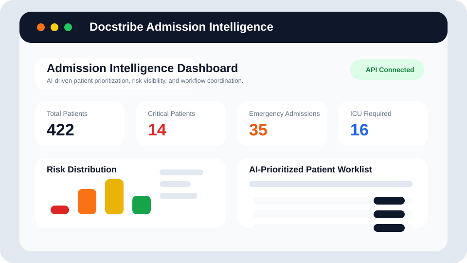
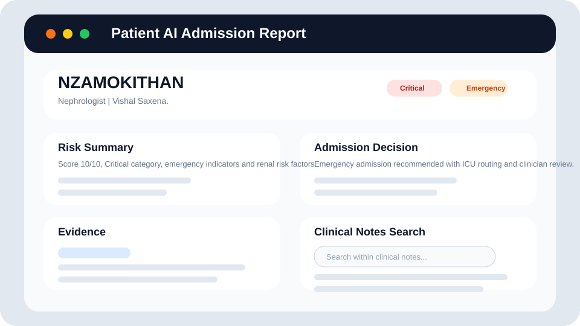
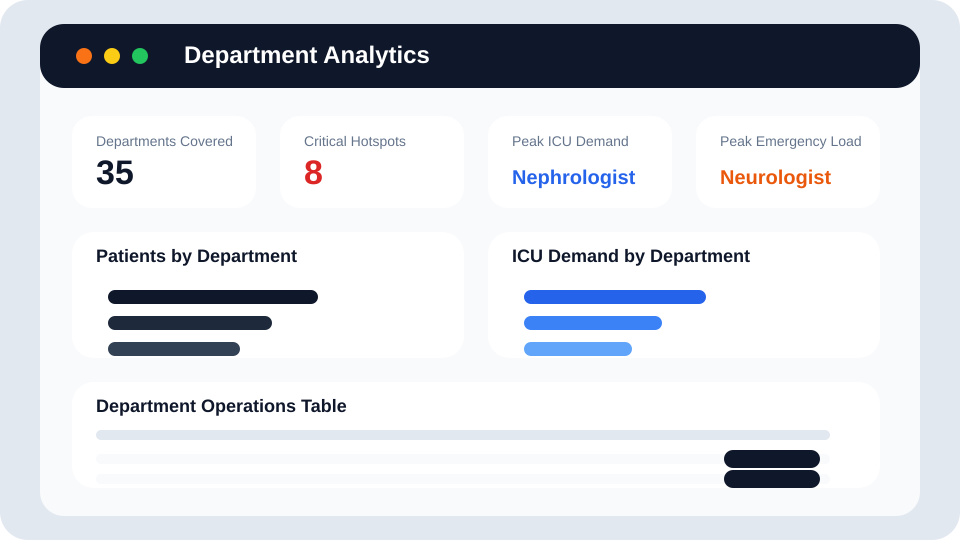

# Docstribe Admission Intelligence

Docstribe is a hospital intelligence demo that combines AI-assisted admission prioritization, clinical explainability, operational bed planning, and department-level analytics in a single workflow. The project is designed to show how a clinical data pipeline can support both doctors and hospital operations teams through a modern React frontend and a FastAPI backend.

## Live Demo

Frontend: `<your-vercel-link>`
Backend API: `<your-render-link>`
Health Check: `<your-render-link>/api/health`

## Project Overview

The platform helps staff answer a few critical questions quickly:

- Which patients need the most urgent attention?
- Which admissions are likely to require ICU coordination?
- What evidence supports the AI recommendation?
- Which departments are generating the highest emergency and ICU demand?

## Problem Statement

Hospital teams often work across fragmented systems where risk, admission urgency, bed planning, and clinical notes are separated across multiple screens or spreadsheets. Docstribe brings those signals together into one interface so a care team can review:

- patient-level admission intelligence
- AI-supported evidence and validation
- operational bed demand
- department-level clinical pressure

## Architecture

```text
React + Vite frontend
        |
        v
FastAPI backend
        |
        v
dashboard_patients.json
        |
        v
AI-generated patient intelligence from backend pipeline engines
```

## Backend AI Engines

The backend pipeline and inference utilities are organized in `backend/inference/` and `backend/pipeline/`.

- `risk_engine.py`: patient risk scoring and severity classification
- `admission_engine.py`: admission urgency classification
- `bed_engine.py`: bed allocation recommendation logic
- `procedure_engine.py`: explicit and inferred procedure intelligence
- `patient_journey_engine.py`: visit history and progression tracking
- `traceability_engine.py`: AI evidence extraction and explainability
- `consistency_validation_engine.py`: validation and consistency checks
- `enhanced_intelligence_engine.py`: higher-level derived intelligence

## Features Implemented

- Dashboard with risk, admission, and bed distribution charts
- Search, filters, pagination, and CSV export for the patient worklist
- API-backed patient profile with printable and downloadable AI admission reports
- Clinical note search with preserved original text and AI-normalized summary
- Explainable AI evidence, validation status, and clinician safety messaging
- Department analytics with drill-down navigation back into the dashboard
- Global navbar with backend API health status and fallback awareness
- Graceful loading, error, and empty states across major pages

## Tech Stack

- Frontend: React, Vite, React Router, Tailwind utility classes, Recharts
- Backend: FastAPI, Uvicorn, Python data-service layer
- Reporting: jsPDF and html2canvas for printable/downloadable admission reports
- Data: JSON-based patient intelligence dataset used through FastAPI endpoints
- Deployment targets: Vercel for frontend, Render for backend

## API Endpoints

Base URL in development is proxied through Vite to `http://127.0.0.1:8000`.

```http
GET /api/health
GET /api/patients
GET /api/patients/{patient_id}
GET /api/dashboard/summary
GET /api/dashboard/charts
```

Sample health response:

```json
{
  "status": "ok",
  "patients_loaded": 422
}
```

## Screenshots

Dashboard



Patient Profile



Department Analytics



## How to Run Locally

### 1. Backend

Create or activate the Python virtual environment, then install dependencies:

```bash
pip install -r requirements.txt
```

Run the FastAPI server:

```bash
uvicorn backend.main:app --reload
```

The backend will start on `http://127.0.0.1:8000`.

### 2. Frontend

Install frontend dependencies:

```bash
cd frontend
npm install
```

Start the Vite app:

```bash
npm run dev
```

The frontend will start on `http://127.0.0.1:5173`.

### 3. Local API Configuration

For local development, the frontend reads `frontend/.env`:

```env
VITE_API_BASE_URL=http://localhost:8000
```

If the backend is down, the dashboard and patient pages can still render from the bundled fallback JSON. In that case, the navbar shows `Using Local Fallback` instead of `API Connected`.

## Deployment Steps

### 1. Deploy the backend on Render

- Create a new Render web service pointing to this repository
- Use `pip install -r requirements.txt` as the build command
- Use `uvicorn backend.main:app --host 0.0.0.0 --port $PORT` as the start command
- Set the health check path to `/api/health`
- Confirm `/api/health`, `/api/patients`, `/api/dashboard/summary`, and `/api/dashboard/charts` respond correctly after deploy

### 2. Deploy the frontend on Vercel

Set the environment variable before deploy:

```text
VITE_API_BASE_URL=https://your-render-backend-url
```

- Import the repository into Vercel and set:
- Root Directory: `frontend`
- Build Command: `npm run build`
- Output Directory: `dist`
- Keep `frontend/vercel.json` for SPA routing support
- After deploy, verify the navbar shows `API Connected` against the Render backend

If Vercel accidentally imports the repository root instead of the `frontend/` app, the root [vercel.json](C:/Users/LENOVO/Downloads/Docstribe/vercel.json:1) now points the build back to `frontend/`. The recommended setup is still to deploy the `frontend` directory directly.

## Verification

Frontend build:

```bash
cd frontend
npm run build
```

Backend smoke test:

```bash
python backend/smoke_test.py
```

## Final Submission Checklist

- Frontend build passes with `npm run build`
- Backend smoke test passes with `python backend/smoke_test.py`
- Render backend responds to `/api/health`, `/api/patients`, `/api/dashboard/summary`, and `/api/dashboard/charts`
- Vercel frontend is configured with `VITE_API_BASE_URL=https://your-render-backend-url`
- Navbar shows `API Connected` against the deployed backend
- Dashboard, patient profile, PDF export, and analytics pages are all demo-tested

## Demo Walkthrough

- Dashboard
- Search and filter the patient worklist
- Export CSV
- Department Analytics
- Open a patient profile
- Show Why AI Gave This Priority
- Show Evidence and traceability
- Download PDF

## Known Limitations

- The demo uses a JSON dataset rather than a production database
- Fallback JSON rendering is helpful for demos, but it is not a substitute for live backend monitoring
- Authentication, user roles, and audit trails are not yet implemented
- The AI reasoning is rules-and-evidence driven and should remain clinician decision support only

## Future Improvements

- Replace JSON-backed loading with a database and persistent patient service layer
- Add authentication and role-based views for clinicians and operations staff
- Expand exports into scheduled cohort reports and longitudinal department trend history
- Connect live EMR or HIS ingestion pipelines
- Add model monitoring, audit logs, and clinician feedback loops
